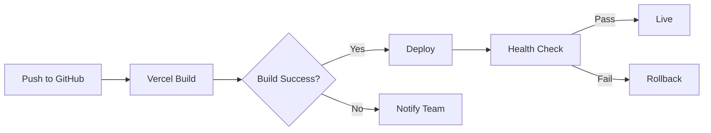

This guide covers deploying the Procurement Calendar application to a production environment. We recommend Vercel for seamless Next.js deployment, but also cover alternative platforms.

## Pre-Deployment Checklist

Before deploying to production, ensure you have:

- ✅ Completed [Supabase setup](/deployment/supabase-setup) with production database
- ✅ Configured all [environment variables](/deployment/environment-variables)
- ✅ Tested the application locally with production database
- ✅ Reviewed and customized catalog data (suppliers, products, destinations)
- ✅ Created at least one admin user

## Deployment Options

### Vercel (Recommended)

Vercel is the recommended platform for Next.js applications with zero-configuration deployment.

<Steps>
  <Step title="Connect Your Repository">
    1. Push your code to a Git repository (GitHub, GitLab, or Bitbucket)
    2. Log in to [Vercel](https://vercel.com)
    3. Click **New Project**
    4. Import your repository
    5. Vercel will automatically detect it's a Next.js project
  </Step>

  <Step title="Configure Environment Variables">
    In the deployment configuration screen:

    1. Expand **Environment Variables** section
    2. Add all three required variables:

    | Name | Value |
    |------|-------|
    | `NEXT_PUBLIC_SUPABASE_URL` | Your Supabase project URL |
    | `NEXT_PUBLIC_SUPABASE_ANON_KEY` | Your Supabase anon key |
    | `SUPABASE_SERVICE_ROLE_KEY` | Your service role key |

    3. Select which environments each variable applies to:
       - ✅ Production
       - ✅ Preview
       - ✅ Development (optional)

    <Warning>
      Mark `SUPABASE_SERVICE_ROLE_KEY` as sensitive to prevent it from being displayed in logs.
    </Warning>
  </Step>

  <Step title="Deploy">
    1. Click **Deploy**
    2. Vercel will:
       - Install dependencies
       - Build your Next.js application
       - Deploy to a production URL
    3. Wait for deployment to complete (usually 2-3 minutes)

    <Info>
      Your application will be available at `https://your-project.vercel.app`
    </Info>
  </Step>

  <Step title="Configure Custom Domain (Optional)">
    To use a custom domain:

    1. Go to your project **Settings** → **Domains**
    2. Add your domain (e.g., `procurement.clorodehidalgo.com`)
    3. Configure DNS records as instructed by Vercel:
       - **A Record**: Point to Vercel's IP
       - **CNAME**: Or point to `cname.vercel-dns.com`
    4. Wait for DNS propagation (up to 48 hours)

    <Note>
      Vercel provides automatic SSL certificates via Let's Encrypt.
    </Note>
  </Step>

  <Step title="Update Supabase Redirect URLs">
    After deployment, update authentication redirect URLs:

    1. Go to your Supabase dashboard
    2. Navigate to **Authentication** → **URL Configuration**
    3. Add your production URL to **Redirect URLs**:
       - `https://your-project.vercel.app/**`
       - `https://your-custom-domain.com/**` (if using custom domain)
    4. Set **Site URL** to your production domain
  </Step>
</Steps>

### Alternative Platforms

<CardGroup cols={2}>
  <Card title="Netlify" icon="globe">
    1. Connect Git repository
    2. Build command: `npm run build`
    3. Publish directory: `.next`
    4. Add environment variables in site settings
  </Card>
  <Card title="Railway" icon="train">
    1. Create new project from GitHub repo
    2. Add environment variables
    3. Railway auto-detects Next.js and deploys
  </Card>
  <Card title="Render" icon="server">
    1. Create new Web Service
    2. Build command: `npm install && npm run build`
    3. Start command: `npm start`
    4. Add environment variables
  </Card>
  <Card title="Docker" icon="docker">
    Use Next.js standalone output for containerized deployments.
  </Card>
</CardGroup>

## Build Configuration

### Build Command

The application uses the standard Next.js build process:

```bash
npm run build
```

This command:
- Compiles TypeScript to JavaScript
- Optimizes and bundles all pages
- Generates static pages where possible
- Creates production-ready assets

### Build Output

Next.js generates the following:

```
.next/
├── cache/              # Build cache for faster rebuilds
├── server/             # Server-side code
├── static/             # Static assets and chunks
└── standalone/         # Self-contained deployment (if configured)
```

<Info>
  The `.next` directory should never be committed to version control.
</Info>

## Environment-Specific Configuration

### Production vs. Development

Key differences in production:

| Feature | Development | Production |
|---------|-------------|------------|
| **Source Maps** | Enabled | Disabled for performance |
| **Hot Reload** | Enabled | N/A |
| **Error Overlay** | Detailed | Generic error pages |
| **Caching** | Minimal | Aggressive |
| **Minification** | None | Full |

### Node Environment

Next.js automatically sets `NODE_ENV=production` during production builds.

## Database Considerations

### Production Database Setup

<Steps>
  <Step title="Use Separate Supabase Project">
    Create a dedicated Supabase project for production:
    - Isolates production data from development
    - Allows safe testing in development
    - Prevents accidental data loss
  </Step>

  <Step title="Run Schema Migration">
    Execute the same `schema.sql` in your production Supabase project:
    
    ```sql
    -- Run this in Supabase SQL Editor for production project
    -- Copy from: supabase/schema.sql
    ```
  </Step>

  <Step title="Customize Seed Data">
    Review and modify seed data before production:
    
    - **Proveedores**: Add your actual suppliers
    - **Productos**: List your real products
    - **Destinos**: Configure your plant locations
    - **Presentaciones**: Adjust to your packaging types

    <Warning>
      Remove or modify sample seed data to match your business requirements.
    </Warning>
  </Step>
</Steps>

### Backups

Supabase automatically backs up your database:

- **Free tier**: Daily backups retained for 7 days
- **Pro tier**: Daily backups retained for 30 days
- **Manual backups**: Available in Supabase dashboard under **Database** → **Backups**

<Note>
  For critical production data, consider implementing additional backup strategies.
</Note>

## Performance Optimization

### Caching Strategy

The application uses Next.js caching:

```typescript
import { unstable_cache } from 'next/cache'

// Example: Cache catalog data
export const getCatalogData = unstable_cache(
  async () => {
    // Fetch from Supabase
  },
  ['catalog'],
  { revalidate: 3600 } // Cache for 1 hour
)
```

### Image Optimization

Next.js automatically optimizes images:
- Serves modern formats (WebP, AVIF)
- Generates multiple sizes
- Lazy loads images

### Database Indexes

Ensure critical indexes are in place (already included in schema):

```sql
CREATE INDEX idx_requisiciones_fecha ON requisiciones(fecha_recepcion);
CREATE INDEX idx_requisiciones_proveedor ON requisiciones(proveedor_id);
CREATE INDEX idx_requisiciones_estatus ON requisiciones(estatus_id);
CREATE INDEX idx_requisiciones_destino ON requisiciones(destino_id);
```

## Monitoring and Maintenance

### Application Monitoring

**Vercel Analytics:**
- Automatically tracks Core Web Vitals
- Real user performance monitoring
- Available in Vercel dashboard under **Analytics**

**Custom Logging:**
Next.js automatically logs:
- Server errors (500 pages)
- Build errors
- API route errors

### Database Monitoring

**Supabase Dashboard:**
1. Navigate to **Database** → **Usage**
2. Monitor:
   - Database size
   - Active connections
   - Query performance
   - Storage usage

<Info>
  Set up email alerts in Supabase for database issues or approaching limits.
</Info>

### Health Checks

Implement health check endpoints:

```typescript app/api/health/route.ts
import { createClient } from '@/lib/supabase/server'

export async function GET() {
  try {
    const supabase = await createClient()
    const { error } = await supabase.from('profiles').select('count').limit(1)
    
    if (error) throw error
    
    return Response.json({ status: 'healthy' })
  } catch (error) {
    return Response.json({ status: 'unhealthy', error }, { status: 503 })
  }
}
```

## Security Considerations

<CardGroup cols={2}>
  <Card title="HTTPS Only" icon="lock">
    Ensure all traffic uses HTTPS. Vercel provides this automatically.
  </Card>
  <Card title="Row Level Security" icon="shield">
    Verify RLS policies are active on all Supabase tables.
  </Card>
  <Card title="Environment Variables" icon="key">
    Never expose service role key in client-side code.
  </Card>
  <Card title="Regular Updates" icon="arrow-up">
    Keep dependencies updated for security patches.
  </Card>
</CardGroup>

### Security Headers

Add security headers in `next.config.ts`:

```typescript next.config.ts
const nextConfig: NextConfig = {
  async headers() {
    return [
      {
        source: '/(.*)',
        headers: [
          {
            key: 'X-Frame-Options',
            value: 'DENY',
          },
          {
            key: 'X-Content-Type-Options',
            value: 'nosniff',
          },
          {
            key: 'Referrer-Policy',
            value: 'origin-when-cross-origin',
          },
        ],
      },
    ]
  },
}
```

## Continuous Deployment

### Automatic Deployments

Vercel automatically deploys:
- **Production**: On push to `main` branch
- **Preview**: On pull requests

### Deployment Workflow



## Rollback Strategy

If issues occur after deployment:

<Steps>
  <Step title="Instant Rollback (Vercel)">
    1. Go to **Deployments** in Vercel dashboard
    2. Find the previous working deployment
    3. Click **⋯** menu → **Promote to Production**
    4. Confirm rollback
  </Step>

  <Step title="Database Rollback">
    If database changes caused issues:
    1. Go to Supabase **Database** → **Backups**
    2. Select the backup before the change
    3. Click **Restore**
    
    <Warning>
      Database rollbacks will lose data created after the backup point.
    </Warning>
  </Step>
</Steps>

## Post-Deployment Tasks

<Steps>
  <Step title="Create Admin User">
    1. Visit your production login page
    2. Sign up with your admin email
    3. In Supabase, manually update the user's role:
    
    ```sql
    UPDATE profiles 
    SET rol = 'admin' 
    WHERE id = 'user-uuid-here';
    ```
  </Step>

  <Step title="Test Core Functionality">
    Verify critical features:
    - ✅ User authentication
    - ✅ Create requisición
    - ✅ Calendar view
    - ✅ Edit requisición
    - ✅ Admin user management
    - ✅ Catalog management
  </Step>

  <Step title="Configure User Access">
    Set up your team:
    1. Have team members sign up
    2. Admin approves and assigns roles
    3. Test role-based permissions
  </Step>

  <Step title="Monitor Performance">
    For the first week:
    - Check Vercel Analytics daily
    - Monitor Supabase database usage
    - Review error logs
    - Gather user feedback
  </Step>
</Steps>

## Troubleshooting

### Build Failures

**TypeScript errors:**
```bash
# Run type checking locally
npm run build
```

**Dependency issues:**
```bash
# Clear cache and reinstall
rm -rf node_modules .next
npm install
npm run build
```

### Runtime Errors

**Check Vercel logs:**
1. Go to your project in Vercel
2. Navigate to **Deployments** → Select deployment
3. Click **Runtime Logs**

**Common issues:**
- Missing environment variables
- Incorrect Supabase credentials
- Database connection timeout
- RLS policy blocking access

### Performance Issues

**Slow page loads:**
- Check Supabase query performance in dashboard
- Review database indexes
- Verify caching is working
- Check Vercel Analytics for bottlenecks

## Next Steps

<CardGroup cols={2}>
  <Card title="User Guides" icon="book" href="/guides/admin-workflow">
    Learn how to use the application by role
  </Card>
  <Card title="API Reference" icon="code" href="/api/auth">
    Explore the API documentation
  </Card>
  <Card title="Database Schema" icon="database" href="/database/schema">
    Database schema and maintenance
  </Card>
  <Card title="GitHub Issues" icon="github" href="https://github.com/AlejandroMartinezG/App_Compras/issues">
    Get help and report issues
  </Card>
</CardGroup>
